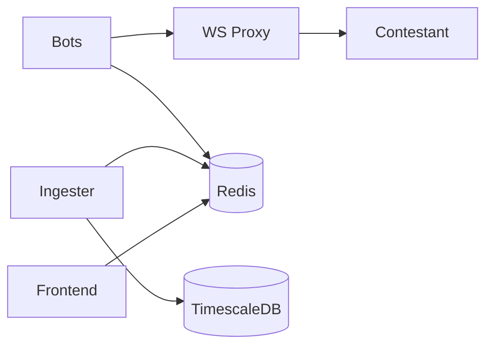

# QuantArena — Trading Sandbox & Benchmarking Platform

**30-second pitch:** Upload a trading server zip → we sandbox it with gVisor, blast it with coordinated-omission-aware load bots, measure p99 with HdrHistogram, score correctness against a reference matching engine, and show a live leaderboard judges can trust.

## Architecture



Full blueprint: [docs/ARCHITECTURE.md](docs/ARCHITECTURE.md)

## Quickstart (4 commands)

```bash
git clone <repo> quantarena && cd quantarena
cp .env.example .env
make demo
open http://localhost:3000
```

Submit + load test:

*For simple echo server (partial credit):*
```bash
make sample-zip
curl -F "file=@examples/sample_orderbook.zip" http://localhost:8000/submit
./scripts/run_load_test.sh <submission_id> ws://localhost:8787/ws/<submission_id> 30
```

*For real matching engine (100% correctness):*
```bash
make real-zip
curl -F "file=@examples/real_matching_engine.zip" http://localhost:8000/submit
./scripts/run_load_test.sh <submission_id> ws://localhost:8787/ws/<submission_id> 30
```

## Tech stack

| Component | Tech | Rationale |
|-----------|------|-----------|
| API | FastAPI | Async, OpenAPI, fast iteration |
| Sandbox | gVisor + seccomp + isolated net | Defense in depth |
| Events | Redis Streams | MAXLEN backpressure, low ops |
| Metrics | HdrHistogram + Prometheus | Correct tails + observability |
| Storage | TimescaleDB hypertables | Time-series p99 |
| Load | Locust + asyncio bots | Distributed mode ready |
| UI | Next.js + SSE + Recharts | Live leaderboard |

## Documentation

| Doc | Description |
|-----|-------------|
| [ARCHITECTURE.md](docs/ARCHITECTURE.md) | System design, scaling, FAQ |
| [MEASUREMENT.md](docs/MEASUREMENT.md) | Coordinated omission, HdrHistogram |
| [THREAT_MODEL.md](docs/THREAT_MODEL.md) | Sandbox mitigations |
| [SCORING.md](docs/SCORING.md) | Composite formula |
| [BACKPRESSURE.md](docs/BACKPRESSURE.md) | Drop policy |
| [CHAOS.md](docs/CHAOS.md) | Resilience tests |
| [SETUP_DAY0.md](docs/SETUP_DAY0.md) | Prerequisites |
| [DECISIONS.md](DECISIONS.md) | Decision log |

## Operations

```bash
make test              # unit tests
make integration       # full loop (requires Docker)
make benchmark         # self-benchmark
make sandbox-test      # escape attempt documentation
./scripts/distributed_locust.sh master   # Locust distributed
./scripts/chaos_demo.sh <id> <ws_url>    # chaos scenarios
```

## gVisor production

```bash
# .env
DOCKER_RUNTIME=runsc
```

Verify: `docker inspect iicpc-<id> --format '{{.HostConfig.Runtime}}'`

## Demo video

Record 5-minute walkthrough: submit → load test → leaderboard → detail page → Prometheus metrics.

Link: *(add YouTube/unlisted URL before submission)*

## Submission checklist

- [x] Working Infrastructure Prototype (`make demo`)
- [x] Architecture Blueprint (`docs/ARCHITECTURE.md`)
- [x] Infrastructure as Code (`infra/terraform`, `infra/k8s`)
- [ ] Demo video URL in README
- [ ] Tag `v1.0-submission`

## License

MIT — hackathon submission 2026.
