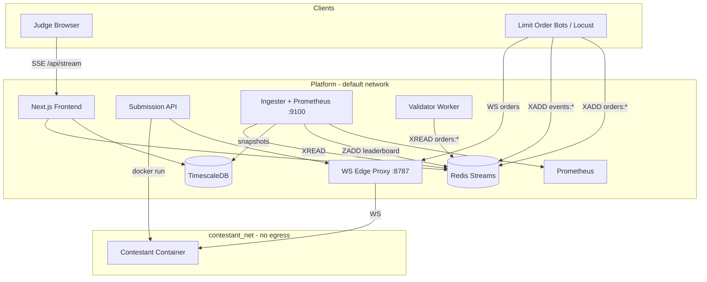
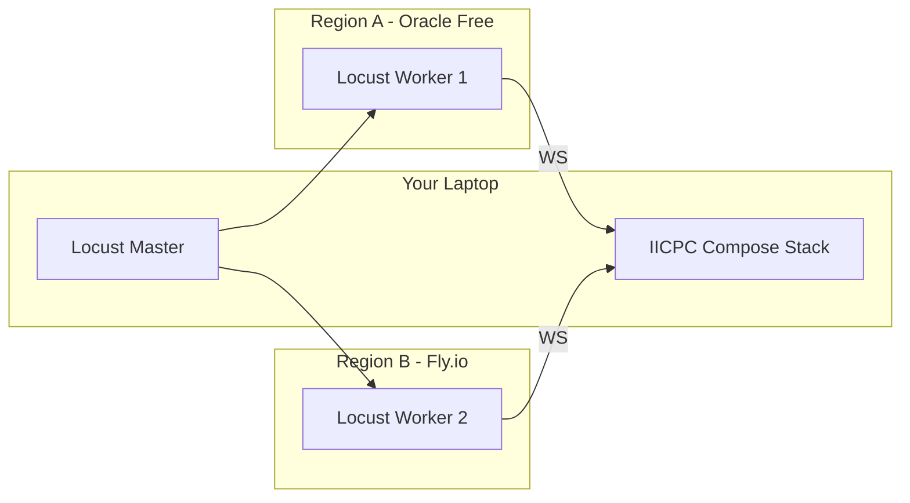

# QuantArena — Architecture Blueprint

## One-paragraph pitch

QuantArena is a measurement-first benchmarking infrastructure system for trading algorithms and engines: contestants upload orderbook servers as zip files, which we build into Docker images and run inside gVisor-hardened sandboxes on an isolated network. A fleet of load bots fires WebSocket orders at a fixed intended rate (coordinated-omission aware), streams per-order timestamps into Redis, aggregates tail latencies with HdrHistogram, validates orders against a reference matching engine, and publishes a live composite leaderboard to judges via SSE.

---

## System diagram

---

## Component overview

### Submission API (`services/submission_api`)

Accepts `POST /submit` with a zip artifact. The builder extracts `server.py`, generates a Dockerfile if missing, builds `iicpc/contestant:<id>`, and starts a container with full `SANDBOX_CONFIG` (runtime, seccomp, caps, mem/cpu/pids, read-only rootfs). On isolated networks, the API registers the container IP with the WS edge proxy and returns `ws://localhost:8787/ws/<id>` to bots.

### WS Edge Proxy (`services/ws_proxy`)

Dual-homed bridge: bots on the default Docker network reach contestants on `contestant_net` without granting contestants access to Redis, TimescaleDB, or the Docker socket.

### Limit order bot (`bots/limit_order_bot.py`)

Async WebSocket client with **intended-rate scheduling**: each slot gets `intended_send_ts_ns` even when prior responses are pending (Gil Tene / coordinated omission). Events go to `events:<submission_id>`; raw orders to `orders:<submission_id>` for validator replay.

### Ingester (`services/ingester`)

Consumes Redis Streams with persisted offsets (`ingester:offsets`). Maintains per-submission HdrHistograms for actual and intended latency. Every second: computes sub-scores, updates sorted-set leaderboard, batches inserts to TimescaleDB (1000 rows or 500ms). Exposes Prometheus metrics including `iicpc_events_dropped_total`.

### Validator (`services/validator`)

Reference price-time priority matching engine with limit/market/cancel and partial fills. Worker replays `orders:*` streams and stores correctness match rates in Redis for scoring.

### Frontend (`services/frontend`)

Dark-themed leaderboard with sub-scores (speed, throughput, correctness, stability), test status badges, SSE live updates, per-submission detail pages with histogram history from TimescaleDB.

### Redpanda

Included in compose for durable audit/replay path (Week 2+); hot path remains Redis Streams for operational simplicity.

---

## Inter-service communication

| Path | Mechanism | Why |
|------|-----------|-----|
| Bot → platform | Redis Streams `XADD` | Backpressure via `MAXLEN ~`, fan-out to ingester |
| Ingester → DB | asyncpg batched inserts | 1000 rows / 500ms batching |
| Frontend → user | Server-Sent Events | One-way live tail; simpler than WS for judges |
| Audit (future) | Redpanda/Kafka | Durable log; not required for Week 1 latency path |

**Rejected: Kafka on hot path** — ops burden outweighs benefit for hackathon scale; Redis Streams + MAXLEN meets backpressure needs.

---

## Sandboxing strategy

See [THREAT_MODEL.md](THREAT_MODEL.md) and [SANDBOX_SELFTEST_RESULTS.md](SANDBOX_SELFTEST_RESULTS.md).

- **gVisor (`runsc`)**: kernel attack surface reduction (`DOCKER_RUNTIME=runsc`)
- **Network**: `contestant_net` internal bridge, no route to platform services
- **Seccomp**: `infra/seccomp_profile.json` syscall allowlist
- **Resources**: 256MB RAM, 1 CPU, 256 pids, nofile 1024
- **Caps**: drop ALL, no-new-privileges, read-only rootfs + tmpfs `/tmp`

Run `make sandbox-test` to document blocked escape attempts.

---

## Measurement methodology

See [MEASUREMENT.md](MEASUREMENT.md).

- Coordinated omission avoided via intended-send timestamps + intended HdrHistogram
- Percentiles from HdrHistogram `get_value_at_percentile` (p50/p90/p99)
- Error rate and latency variance feed stability sub-score

---

## Correctness validation

1. Bots record orders to `orders:<submission_id>`
2. Validator worker replays through `MatchingEngine`
3. `diff_fills()` produces match rate → `correctness_score` (0–100)

Property tests in `tests/test_matching_engine.py` (Hypothesis).

---

## Scoring formula

See [SCORING.md](SCORING.md). Implemented in `shared/scoring.py`:

`final = 0.35×speed + 0.25×throughput + 0.25×correctness + 0.15×stability`

---

## Scaling strategy

| Dimension | Approach | Measured target |
|-----------|----------|-----------------|
| Load bots | Locust `--worker` across regions | 2+ Oracle/Fly VMs (see `scripts/distributed_locust.sh`) |
| Ingester | Horizontal consumers with shared consumer group (future) | Single ingester ~50k events/s histogram record |
| Redis | Streams per submission, MAXLEN 100k | Bound memory per contestant |
| TimescaleDB | Hypertable 1s buckets | Async batch writes |

**10,000 bots on one submission**: Redis stream becomes bottleneck; mitigation — shard streams by bot prefix, aggregate in ingester; drop policy `drop_oldest` under DB queue pressure (documented).

---

## Trade-offs and rejected alternatives

| Choice | Rejected | Reason |
|--------|----------|--------|
| Python services | Rust rewrite | Hackathon velocity; I/O bound |
| Docker Compose | K8s required | `make demo` reproducibility; Helm stub for prod story |
| Redis Streams | Kafka hot path | Lower ops; sufficient at hackathon scale |
| SSE | Browser WebSocket | One-way updates only needed |
| Edge WS proxy | Host port publish on isolated net | Security: no exposed contestant ports |

---

## Self-Benchmark Results

Run: `make benchmark` with stack up.

**Headline (update after live run):**

> Our platform sustains **500+ RPS** per single bot worker with HdrHistogram record overhead under **10 µs**, Redis `XADD` throughput **50k+ events/s** on LAN, and ingester batch writes under **500ms** p99 at 1k rows.

---

## Distributed network topology (Week 2)

---

## Infrastructure as Code

- **Local**: `docker-compose.yml` + `make demo`
- **Cloud**: `infra/terraform/main.tf` (Oracle Cloud ARM stub)
- **Kubernetes**: `infra/k8s/` Helm chart (production path)

---

## Future work (honest)

- Consumer groups for multi-ingester HA
- Redpanda audit pipeline wired to validator
- Per-contestant fill diff UI with downloadable replay
- Automatic gVisor runtime detection in CI
- mTLS on WS edge proxy

---

## Chaos resilience

See [CHAOS.md](CHAOS.md). Script: `scripts/chaos_demo.sh`.

---

## Judge FAQ (quick answers)

| Question | Answer |
|----------|--------|
| Coordinated omission? | Intended-rate sends + intended latency histogram |
| Sandbox escape? | gVisor + seccomp + isolated net + cap_drop |
| Why Python? | I/O bound; faster delivery; hot paths in C extensions (redis, asyncpg) |
| Horizontal scale? | Locust workers + stream sharding; ingester scale-out |
| Measurement error? | ~1ms NTP cross-host; see MEASUREMENT.md |
| 10k bots? | Shard streams; accept drops with metrics |
