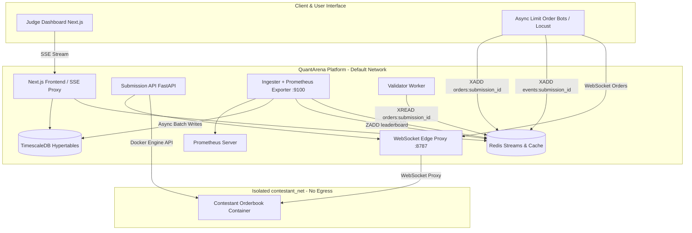
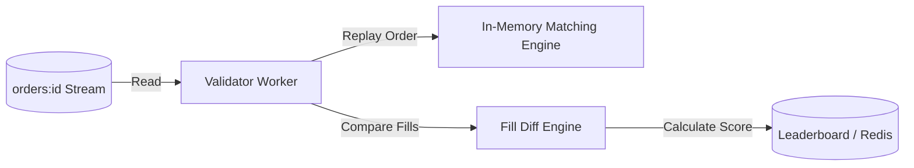

# QuantArena Design Document — Secure Sandboxed Trading Benchmarking Platform

QuantArena is a production-grade, secure sandboxing and microsecond-precision latency measurement platform designed to benchmark contestant-submitted trading orderbook servers under realistic, high-throughput loads.

---

## 1. Executive Summary

At the core of quantitative trading platform development is performance validation. QuantArena provides a measurement-first infrastructure that allows judges and engineers to:
1. **Safely Containerize Untrusted Submissions**: Automatically sandbox contestant Python servers using **gVisor** (`runsc`), seccomp syscall filtering, namespaces, capability drops, and hard resource limits.
2. **Execute Coordinated Omission-Free Load Generation**: Simulate order books with async websocket load-testing bots using slot-scheduler intended-rate calculations (Gil Tene methodology).
3. **Validate correctness**: Compare live trade fill events against a reference price-time priority matching engine.
4. **Publish Real-time Observability**: Stream latency histograms, metrics, throughput, stability scores, and correctness matching rates to a live reactive dashboard.

---

## 2. System Architecture

QuantArena is built as a set of decoupled services coordinated through event streams (Redis) and telemetry systems (TimescaleDB / Prometheus).



### Component Overview

| Component | Path | Language / Tech | Description & Core Purpose |
| :--- | :--- | :--- | :--- |
| **Submission API** | [services/submission_api](file:///c:/Users/ashis/Downloads/xyz-main/xyz-main/services/submission_api) | Python (FastAPI + Docker SDK) | Manages uploaded ZIP files, triggers Docker builds, and spins up sandboxed contestant containers with hardened security configurations. |
| **WS Edge Proxy** | [services/ws_proxy](file:///c:/Users/ashis/Downloads/xyz-main/xyz-main/services/ws_proxy) | Python (FastAPI + Websockets) | Dual-homed network bridge. Exposes a public websocket port for bots and routes messages to the contestant container inside the isolated network. |
| **Load Bots** | [bots/limit_order_bot.py](file:///c:/Users/ashis/Downloads/xyz-main/xyz-main/bots/limit_order_bot.py) | Python (Asyncio) | High-performance trading bot that schedules trades at a fixed rate, records actual vs intended send timestamps, and logs events to Redis. |
| **Ingester** | [services/ingester](file:///c:/Users/ashis/Downloads/xyz-main/xyz-main/services/ingester) | Python (HdrHistogram + asyncpg) | Consumes events from Redis Streams, aggregates actual and intended latencies using HdrHistogram, flushes snapshots to TimescaleDB, and updates the Redis leaderboard. |
| **Validator** | [services/validator](file:///c:/Users/ashis/Downloads/xyz-main/xyz-main/services/validator) | Python (Hypothesis + Order Book) | Replays order event streams from Redis, passes them to an in-memory reference price-time priority matching engine, and computes correctness metrics. |
| **Frontend** | [services/frontend](file:///c:/Users/ashis/Downloads/xyz-main/xyz-main/services/frontend) | Next.js (TypeScript + Recharts) | Renders the real-time leaderboard table, sub-score breakdowns, and live sparkline charts using Server-Sent Events (SSE). |

---

## 3. Sandboxing & Threat Model (Security)

QuantArena executes untrusted user code (arbitrary Python scripts). It enforces a strict **zero-trust defense-in-depth model** to prevent host compromise, network scanning, database tampering, and CPU/memory starvation.

### Security Mitigations

> [!IMPORTANT]
> The security profile relies on **gVisor (`runsc`)** for system call-level isolation. Ensure the local system has `runsc` configured in docker-desktop and set `DOCKER_RUNTIME=runsc` in `.env`.

| Attack Vector | Threat Level | Mitigation Applied | Enforcement Method |
| :--- | :--- | :--- | :--- |
| **Privilege Escalation** | Critical | Kernel-level syscall isolation, no-new-privileges flag | gVisor Runtime (`runsc`) + `no-new-privileges:true` |
| **Host System Access** | Critical | Drop all Linux capabilities, read-only root filesystems | `cap_drop = ["ALL"]`, `read_only = True` |
| **Resource Starvation** | High | Dedicated CPU pinning, memory ceiling, pid limit | `cpuset_cpus = "2,3"`, `mem_limit = "256m"`, `pids_limit = 256` |
| **Intranets/DB Scanning** | High | Restricted container network with no outbound gateways | `network_mode = "contestant_net"` (isolated bridge) |
| **Fork Bombs** | Medium | Bounded process execution ceiling | `pids_limit = 256`, `nofile` / `nproc` ulimits |
| **Malicious File Alterations**| Medium | Read-only image mount with minimal tmpfs write buffers | `tmpfs = {"/tmp": "size=64m,noexec"}` |

### Isolated Network Layout
```
                          [ Default Docker Network ]
                    ┌──────────────────────────────────┐
                    │  Locust Bots / Ingester / Redis  │
                    └─────────────────┬────────────────┘
                                      │
                                      ▼ Websocket Orders (:8787)
                            ┌──────────────────┐
                            │  WS Edge Proxy   │
                            └─────────────────┬┘
                                      │
                                      ▼ Isolated Bridge Network (No Route to DB)
                    ┌──────────────────────────────────┐
                    │       Contestant Container       │
                    └──────────────────────────────────┘
```

---

## 4. Latency Measurement & Coordinated Omission

Latency measurement systems often suffer from **Coordinated Omission (CO)**. If a benchmark bot only sends a request after the previous one completes, the bot stalls in sync with target slowness, artificially dropping requests and missing high tail latencies.

```
COORDINATED OMISSION (Sync Bots):
T0 [Req 1] ──► Processing (10ms) ──► Recv Ack
T10           [Req 2] ──► STALL (90ms) ──► Recv Ack
T100                      [Req 3] ──► Processing (10ms) ──► Recv Ack
Total: 3 requests over 110ms. Averaged latencies hide the 90ms system stall for requests that should have fired.

QUANTARENA BOT (Slot Scheduling):
T0 [Req 1] ──► Processing (10ms)
T10           [Req 2] ──► STALL (90ms)
T20                      [Req 3] ──► Queued/Sent (stalls 80ms)
Total: 3 requests scheduled. Req 3 tracks intended send at T20, catching the full 80ms delay.
```

### The Solution: Intended-Rate Scheduling

QuantArena’s limit order bots resolve Coordinated Omission using a dual-timestamping, non-blocking scheduler:
1. **Intended Send Time (`intended_send_ts_ns`)**: Scheduled boundary timestamp based on the target execution interval.
2. **Actual Send Time (`sent_ts_ns`)**: Timestamp recorded right before writing to the WebSocket connection.
3. **Completion Time (`ack_ts_ns`)**: Monotonic timestamp recorded on the client or returned from the server.
4. **Dual HdrHistograms**:
   * **Actual Latency** = `ack_ts_ns - sent_ts_ns`
   * **Intended Latency** = `ack_ts_ns - intended_send_ts_ns` (reflects the true impact of system stalls)

> [!TIP]
> We use the high-performance **HdrHistogram** (`HdrHistogram(1, 60_000_000, 3)`) supporting microsecond resolution up to 60 seconds with constant memory overhead.

---

## 5. Correctness Validation

Speed is worthless without correctness. A contestant could score highly by dropping orders or returning dummy fills. QuantArena replays every trade event against a reference matching engine.



### The Reference Matching Engine
The validator implements an in-memory, price-time priority matching engine supporting:
* **Limit Orders**: Resting orders placed in double-ended queues (bids/asks) matching on better prices first.
* **Market Orders**: Instantly fill against resting liquidity or cancel unexecuted balance.
* **Cancel Orders**: Remove active orders from the book.
* **Partial Fills**: Correctly track remaining sizes.

The validator compares the fills returned by the contestant with the expected reference engine output. The **correctness score** is defined as:
$$\text{Correctness Score} = \frac{\text{Matching Fills}}{\text{Total Expected Fills}} \times 100$$

---

## 6. Scoring Methodology

QuantArena ranks submissions using a composite score that measures performance, speed, accuracy, and consistency under load.

### Composite Score Weights

$$\text{Final Score} = 0.35 \times \text{Speed} + 0.25 \times \text{Throughput} + 0.25 \times \text{Correctness} + 0.15 \times \text{Stability}$$

### Sub-Score Definitions

* **Speed Score (0-100)**: Measures the $p99$ tail latency of intended requests. Pinned against a 50ms baseline.
  $$\text{Speed} = \text{clamp}\left(0, 100, \frac{50\text{ms}}{p99\text{ latency}} \times 50\right)$$
* **Throughput Score (0-100)**: Target throughput is set to $1000$ RPS.
  $$\text{Throughput} = \text{clamp}\left(0, 100, \frac{\text{Sustained RPS}}{1000} \times 100\right)$$
* **Correctness Score (0-100)**: Evaluated directly from the validator's fill match rate.
* **Stability Score (0-100)**: Penalizes timeouts, failed HTTP/WS responses, and high latency variance ($p99 - p50$ spread).
  $$\text{Stability} = \text{max}\left(0, 100 - (\text{error rate} \times 1000) - \frac{\text{variance}}{1000}\right)$$

---

## 7. Backpressure & Drops

During high-volume benchmarks, telemetries could overwhelm the database. QuantArena adopts a strict **drop policy** to prioritize live leaderboards and protect core platform services.

* **Redis Stream Bounds**: Bounded using `MAXLEN ~ 100000` to prevent memory exhaustion on the Redis instance.
* **Ingester DB Queue**: Buffered using an `asyncio.Queue` capped at 10,000 pending snapshots.
* **Drop Policy (`drop_oldest`)**: When the queue overflows, the oldest pending metric snapshot is discarded in favor of writing the newest snapshot. This ensures the live leaderboard is fed with recent $p99$ statistics instead of stale history.

---

## 8. Deployment & IaC

QuantArena is designed to run in three main environments:

1. **Local Development**: Configured using `docker-compose.yml` for quick execution of Redis, TimescaleDB, Redpanda, the submission API, the frontend, and load testing bots.
2. **Production Kubernetes**: Helm charts in `infra/k8s` define deployments, configmaps, and service configurations for production clusters.
3. **Cloud Infrastructure**: Terraform configurations in `infra/terraform` provision Oracle Cloud infrastructure (ARM computation instances + VCN isolated networks).
